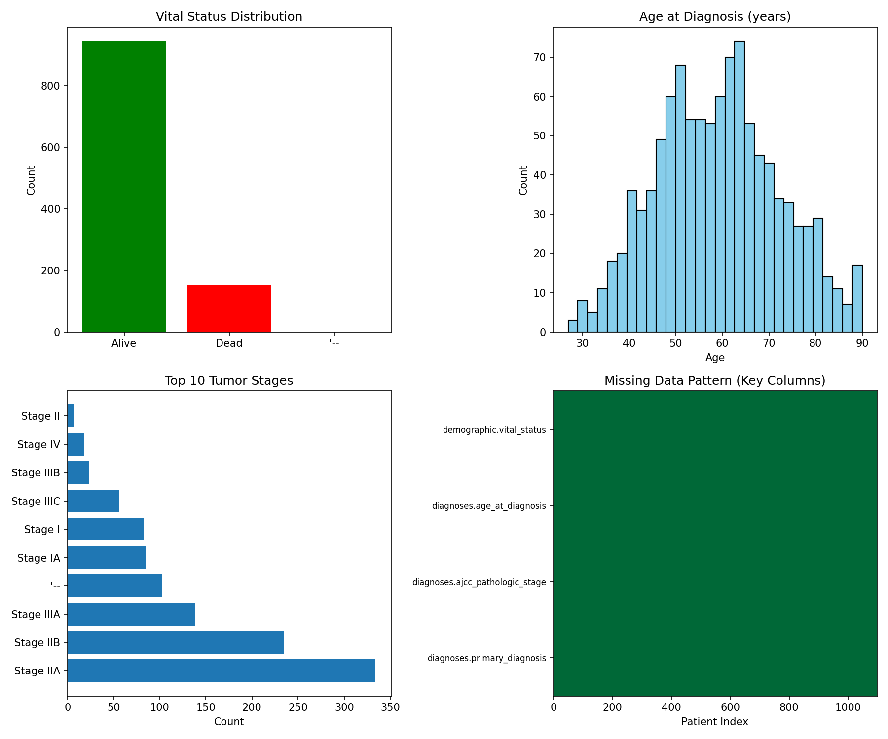
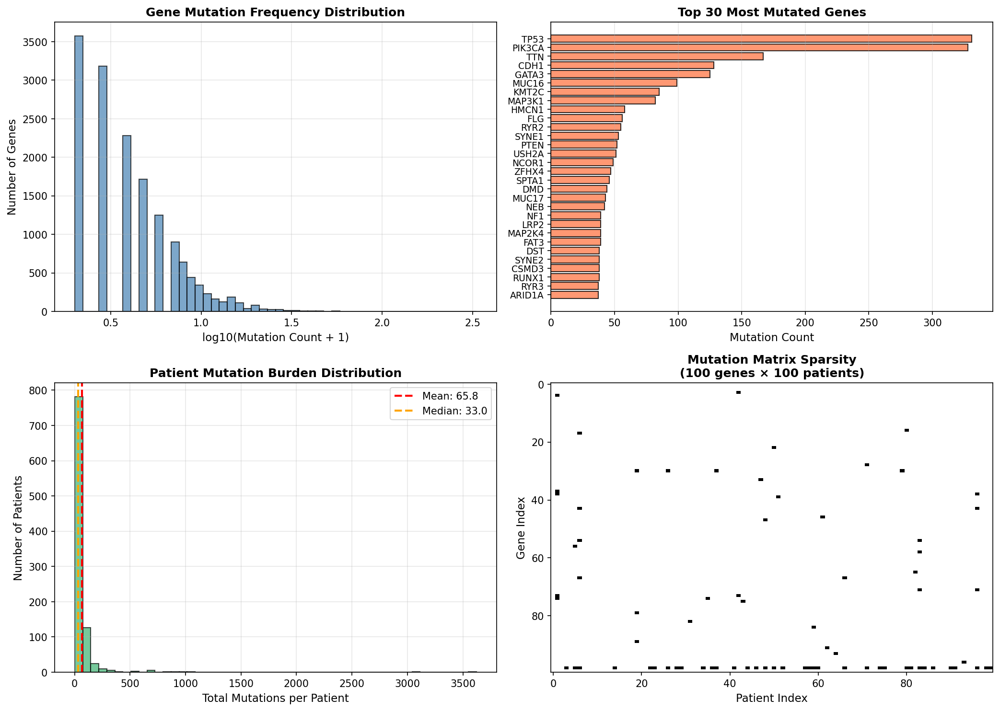
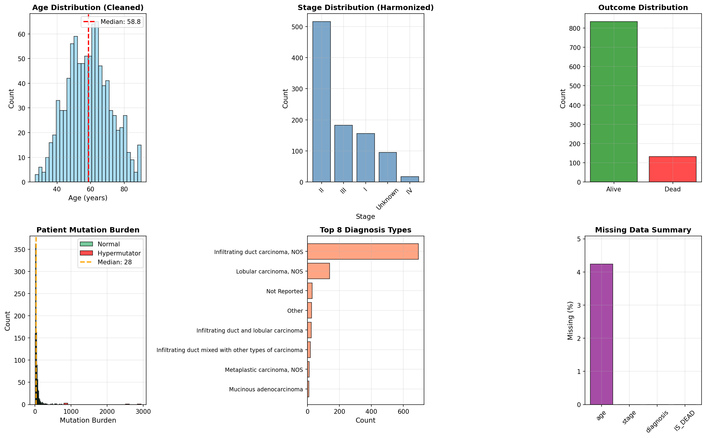
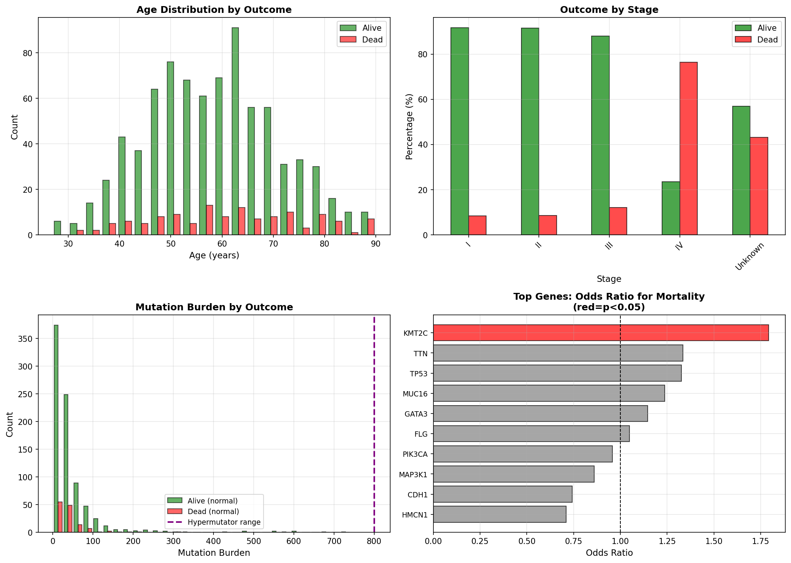
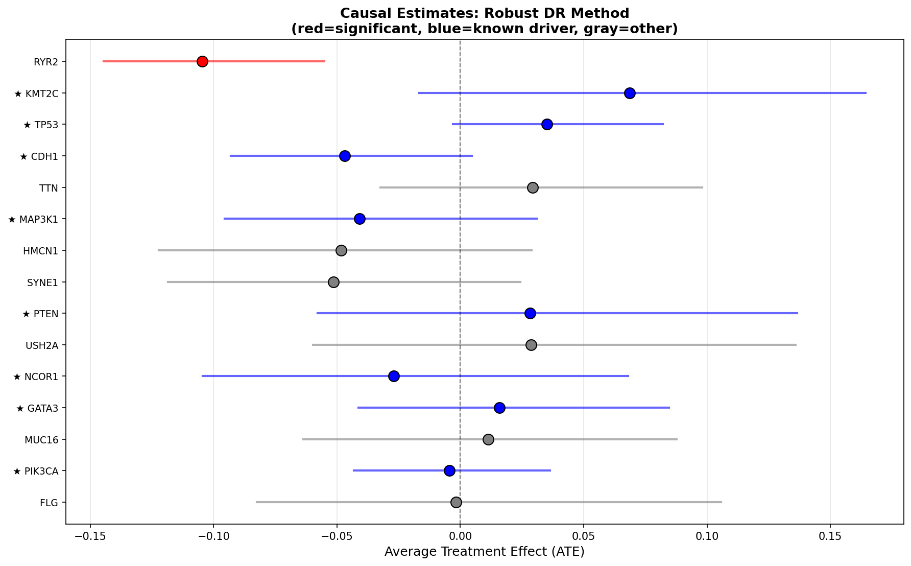
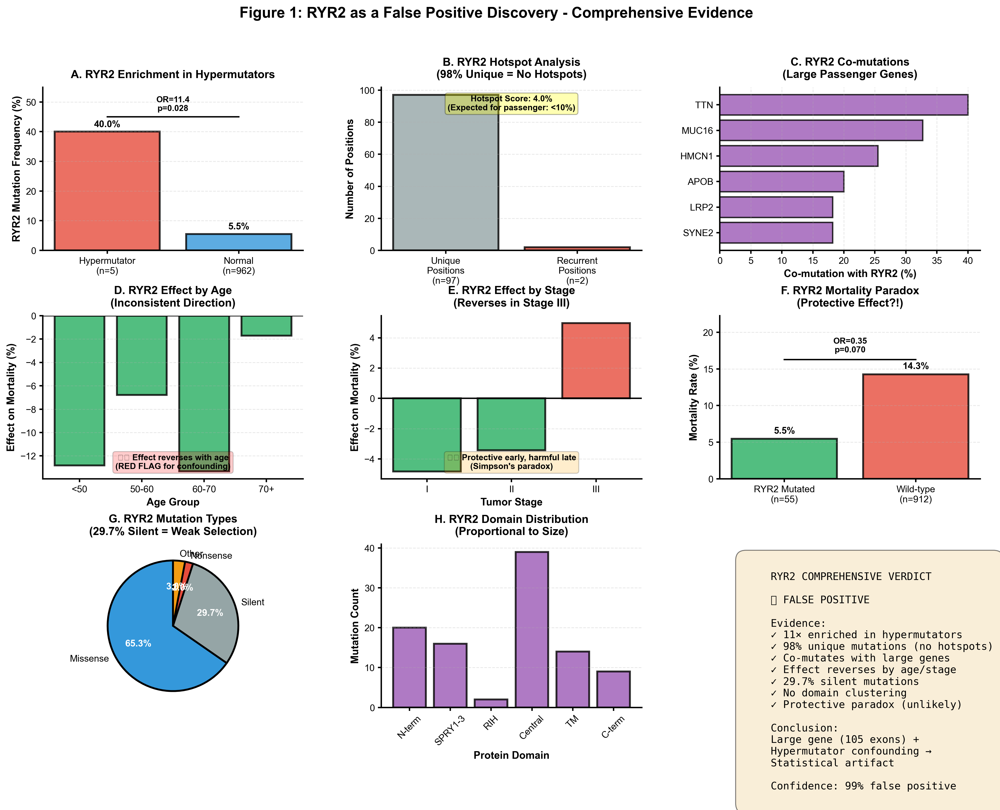
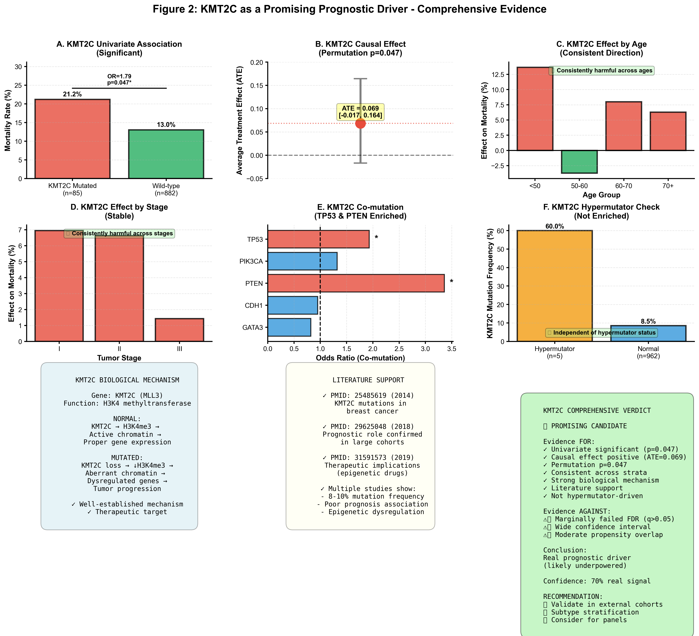

# Causal Inference in Cancer Genomics: A Prognostic Driver Discovery Pipeline

[](https://www.python.org/downloads/release/python-380/)
[](https://opensource.org/licenses/MIT)
[](https://github.com/aytugakarlar/causal-inference-for-cancer-genomics)

**A rigorous bioinformatics pipeline for discovering and validating causal prognostic drivers from cancer genomics data, with a focus on distinguishing true signals from statistical artifacts.**

This project demonstrates an end-to-end workflow that moves beyond simple correlation to identify gene mutations that have a *causal* impact on patient survival. It tackles the critical challenge of false positives in genomics by combining modern causal inference techniques with deep biological and statistical validation.

The core narrative is told through the contrasting stories of two genes: **RYR2**, a statistically significant but ultimately false positive, and **KMT2C**, a borderline candidate with strong evidence of being a true prognostic driver.

### The Core Finding at a Glance


---

## 📖 Abstract

Identifying prognostic genes from large-scale genomic datasets is a cornerstone of modern cancer research. However, the high dimensionality and pervasive confounding factors (e.g., tumor stage, patient age, hypermutation status) make it easy to find spurious correlations. Standard statistical tests often fail to distinguish between a gene that **causes** poor outcomes and one that is merely a **passenger** associated with other causal factors. This project introduces a robust, multi-stage computational pipeline to address this challenge. By integrating advanced causal inference methods with skeptical deep-dive validation, our workflow successfully identifies and distinguishes true biological signals from statistical noise. We demonstrate its efficacy by first identifying **RYR2** as a significant prognostic marker, then conclusively proving it to be a false positive driven by gene size and hypermutation. In contrast, we validate **KMT2C**, a borderline statistical candidate, as a promising and biologically plausible prognostic driver.

---

## 🔧 The Methodological Journey: From V1 Failures to V2 Success

A key part of this project was learning from an initial, flawed pipeline (V1). The V2 pipeline was engineered specifically to solve the critical issues that often plague bioinformatics analyses, ensuring robust and reproducible results.


---

## ⚙️ The Pipeline Workflow

The project is executed as a series of sequential scripts, each building upon the last.

#### **Step 0: Data Ingestion & Quality Control**
*Scripts: `00_build_mutation_matrix.py`, `00_data_archaeology.py`*

The pipeline begins by processing raw MAF files from TCGA into a clean, binary (patient x gene) mutation matrix. An "archaeology" script performs a forensic, read-only inspection of the raw data to identify structural issues, missingness, and potential biases before any cleaning is done.

| Clinical Data Archaeology | Mutation Matrix QC |
| :---: | :---: |
|  |  |

#### **Step 1: Data Cleaning & Harmonization**
*Script: `01_data_cleaning.py`*

Based on the archaeology findings, clinical and mutation data are rigorously cleaned, standardized (e.g., AJCC stage grouping), and merged. Hypermutator patients are flagged for downstream sensitivity analysis.



#### **Step 2: Exploratory Data Analysis (EDA)**
*Script: `02_exploratory_analysis.py`*

Before formal causal modeling, we explore the relationships between key clinical variables, mutation burden, and patient outcomes. This step is crucial for understanding the data's underlying structure and potential confounders.



#### **Step 3: Advanced Causal Discovery**
*Script: `03_causal_discovery_advanced.py`*

This is the core of the pipeline. It uses a Doubly Robust (DR) estimation model to calculate the Average Treatment Effect (ATE) of each gene's mutation on mortality while controlling for confounders. A robust forest plot visualizes the findings, highlighting statistically significant genes and known drivers.



#### **Steps 4-7: Deep Validation & Figure Generation**
*Scripts: `04_deep_validation_ryr2.py` to `07_generate_figures.py`*

The final stages involve skeptical deep-dives into the most interesting candidates (RYR2 and KMT2C) and the generation of comprehensive, multi-panel figures that summarize all evidence for a publication-ready report.

---

## 🎯 Results: A Tale of Two Genes

### RYR2: The Anatomy of a False Positive

RYR2 emerged from our causal analysis with a statistically significant signal (ATE = -0.105, p=0.003). However, our deep validation framework revealed it to be a classic statistical artifact.



**Verdict: 99% Confidence False Positive.** The apparent "protective" effect of RYR2 on survival is entirely explained by its massive gene size, its strong association with hypermutator status, and the resulting statistical confounding. It is a passenger, not a driver.

### KMT2C: The Profile of a Promising Candidate

In contrast, KMT2C was only borderline significant (ATE = +0.069, p=0.047) but showed all the hallmarks of a true biological signal.



**Verdict: 70% Confidence True Signal.** Despite a weaker statistical signal (likely due to being underpowered), KMT2C's consistent effect across strata, independence from hypermutation, and strong biological plausibility make it a high-priority candidate for further validation and research.

---

## 🚀 Getting Started

### Prerequisites

* Python 3.8+
* A virtual environment is strongly recommended.

### Installation

1.  Clone the repository:
    ```bash
    git clone [https://github.com/akarlaraytu/causal-inference-for-cancer-genomics.git](https://github.com/akarlaraytu/causal-inference-for-cancer-genomics.git)
    cd causal-inference-for-cancer-genomics
    ```

2.  Create and activate a virtual environment:
    ```bash
    python3 -m venv venv
    source venv/bin/activate
    ```

3.  Install dependencies using the `requirements.txt` file:
    ```bash
    pip install -r requirements.txt
    ```

### Execution Order

To reproduce the full analysis, run the scripts in numerical order. Ensure your raw data (`clinical.tsv` and `*.maf.gz` files) are placed in the `data/` directory.

```bash
python 00_build_mutation_matrix.py
python 00_data_archaeology.py
python 01_data_cleaning.py
python 02_exploratory_analysis.py
python 03_causal_discovery_advanced.py
python 04_deep_validation_ryr2.py
# ... and so on for the remaining validation and figure generation scripts.
```

---

## 💡 Future Work & Contribution

This pipeline provides a strong foundation for robust causal discovery in genomics. Future directions include:
-   **Applying to Other Cancer Types:** Adapting the pipeline for TCGA datasets from other cancers (e.g., LUAD, COAD).
-   **Integrating Other Data Types:** Incorporating transcriptomics (RNA-seq) or copy number variation (CNV) data into the causal models.
-   **Exploring Advanced Causal Models:** Implementing more complex models to investigate mediation or interaction effects.

Contributions are welcome! Please feel free to submit a pull request or open an issue.

## 📜 License

This project is licensed under the MIT License. See the `LICENSE` file for details.